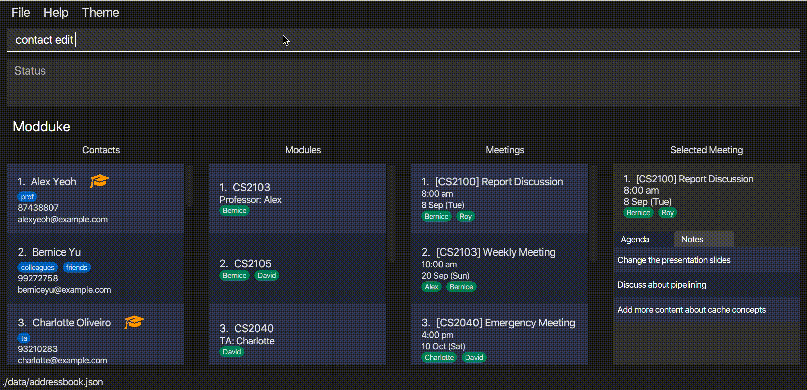
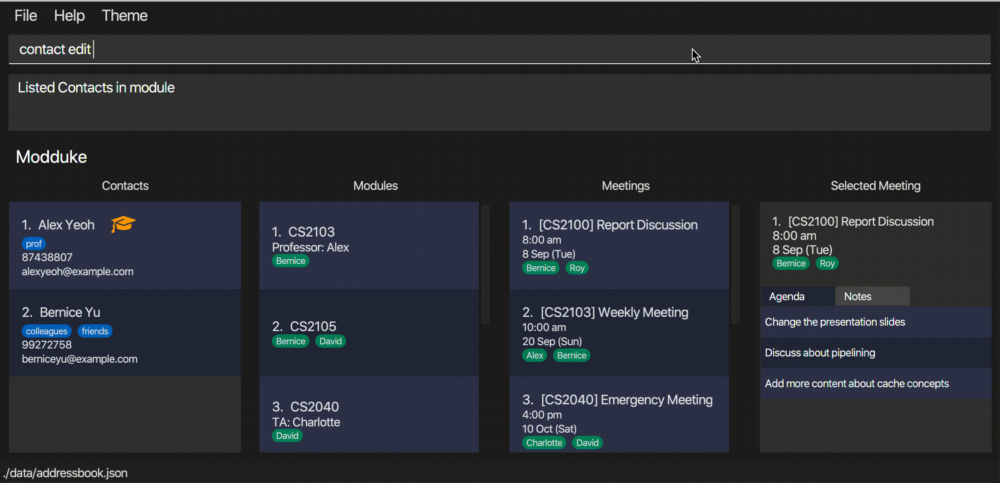
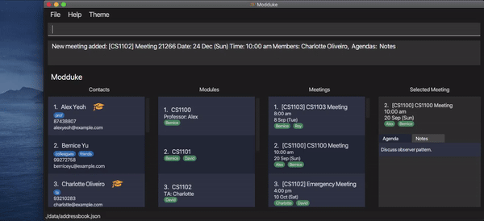

Modduke is a **desktop app for managing contacts, optimized for use via a Command Line Interface** (CLI) while still having the benefits of a Graphical User Interface (GUI). If you can type fast, Modduke can get your module management tasks done faster than traditional GUI apps.

* Table of Contents
{:toc}

--------------------------------------------------------------------------------------------------------------------

## Quick start

1. Ensure you have Java `11` or above installed in your Computer.

1. Download the latest `modduke.jar` from [here](https://github.com/AY2021S1-CS2103-F10-2/tp/releases).

1. Copy the file to the folder you want to use as the _home folder_ for your Modduke.

1. Using your terminal, navigate to folder containing `modduke.jar` and run the command `java -jar modduke.jar`. The GUI similar to the below should appear in a few seconds. Note how the app contains some sample data. 
   

1. Type the command in the command box and press Enter to execute it. e.g. typing **`help`** and pressing Enter will open the help window. 
   Some example commands you can try:

   * **`contact list`** : Lists all contacts.

   * **`contact add`** `n/John Doe p/98765432 e/johnd@example.com` : Adds a contact named `John Doe` to Modduke.

   * **`contact delete`** `n/John Doe` : Deletes `John Doe` from the Modduke.

   * **`contact clear`** : Deletes all contacts.

   * **`exit`** : Exits Modduke.

1. Refer to the [Features](#features) below for details of each command.

--------------------------------------------------------------------------------------------------------------------

## Features

**:information_source: Notes about the command format:** 

* Words in `UPPER_CASE` are the parameters to be supplied by the user. 
  e.g. in `add n/NAME`, `NAME` is a parameter which can be used as `add n/John Doe`.

* Items in square brackets are optional. 
  e.g `n/NAME [t/TAG]` can be used as `n/John Doe t/friend` or as `n/John Doe`.

* Items with `…`​ after them can be used multiple times including zero times. 
  e.g. `[t/TAG]…​` can be used as ` ` (i.e. 0 times), `t/friend`, `t/friend t/family` etc.

* Parameters can be in any order. 
  e.g. if the command specifies `n/NAME p/PHONE_NUMBER`, `p/PHONE_NUMBER n/NAME` is also acceptable.

* There are 2 special tags `prof` and `ta`. Contacts with either of these tags will be classified as professor or ta
 respectively. Users are not allowed to tag a contact as both `prof` and `ta`.

### Viewing help : `help`

Shows a message explaining how to access the help page.

Format: `help`

### Fuzzy Finding Completion (Fzf)

Currently Modduke supports Fuzzy Finding Completion from v1.4 onward. You can trigger the `fzf` mode
using `ctrl + space`. Currently our fzf will search through all contact names, module names and meeting names and will
match entries that contain the prefix entered.

You can exit `fzf` mode by manually pressing `esc`. You will also be taken automatically out of `fzf` mode once you select one 
of the fzf options by navigating to desired option using arrow keys and making the selection by pressing `enter`. Alternatively, 
you can make the selection using your mouse. 

Note that the intuitive `tab` and `shift-tab` navigation is currently NOT supported in v1.4 although you can use these keys to jump to the first option in the fzf menu.

### Autocompletion

Currently Modduke supports autocompletion for the following fields for v1.3 onward. Note that this is a legacy
feature and most of its functionality can be achieved using our newer Fzf completion.

* Contact Name -  Triggered using `cn/`
* Module Name -  Triggered using `mdn/`
* Meeting Name -  Triggered using `mtn/`

Typing in these trigger phrases will turn the text yellow to show that CommandBox has entered Autocompletion Mode.
Use `Tab` to scroll forward and `Shift-Tab` to iterate backwards through suggestions.

Note that this autocompletion can only be triggered at the end of input string e.g.
- `contact edit cname/` will trigger the autocomplete but
- `contact edit cname/ p/98830181` this would not as there is text after the prefix.

* Note that while in Autocomplete mode you cannot edit suggestions unless you iterated back to your own input or you press `Backspace`.
* Pressing `Enter` will lock in your current selection and take you out of Autocomplete mode.

### Adding a contact : `contact add`

Adds a contact to Modduke.

Format: `contact add n/NAME p/PHONE_NUMBER e/EMAIL [t/TAG]...`

Note(s): 
* All fields are required except those in square brackets. No duplicate names.
* NAME must be alphanumeric.
* PHONE_NUMBER must be at least 3 digits but not longer than 20 digits.

Example(s):
* `contact add n/John Doe p/98765432 e/johnd@example.com`

### Deleting a contact : `contact delete`

Delete contacts with the given criteria from Modduke.

Format: `contact delete [n/CONTACT_NAME]... [m/MODULE_NAME]... [t/TAG_NAME]...`

Note(s):
* [n/CONTACT_NAME], [m/MODULE_NAME] and [t/TAG_NAME] are all optional fields.
* At least one of the optional fields must be provided.
* If there are no more members in a meeting or module after they are deleted, then the meeting or module will be deleted as well.

Example(s):
* `contact delete n/Roy Chan n/Jake Ng` delete contacts `Roy Chan` and `Jake Ng` from Modduke.
* `contact delete m/CS2103 t/classmates` deletes all contacts in `CS2103` module or have `classmates` tag

### Editing a contact : `contact edit`

Edits an existing contact in Modduke.

Format: `contact edit CONTACT_NAME [n/NEW_NAME] [p/PHONE] [e/EMAIL] [m/MODULE]`

Note: At least one optional field must be provided

Examples:
*  `contact edit John Doe p/91234567 e/johndoe@example.com` Edits the phone number and email address of John Doe to be `91234567` and `johndoe@example.com` respectively.
*  `contact edit Roy Chan n/Betsy Crower` Edits the name of Roy Chan to be `Betsy Crower` and clears all existing tags.

### Clearing all contacts : `contact clear`

Deletes all existing contacts.

Format: `contact clear`

Note(s):
* Once cleared, contacts are permanently deleted.
* This command will also clear all meetings and modules.

### Viewing all contacts : `contact list`

Shows a list of all contacts in the address book.

Format: `contact list`

### Finding contacts: `contact find`

Shows a list of all contacts in the address book that have the given keywords in their name and/or the given tags.

Format: `contact find [n/KEYWORD]... [t/TAG_NAME]...`

Note(s):
* At least one optional field must be provided.
* KEYWORD is CASE-INSENSITIVE
* KEYWORD can be the initials of the full name (first letter of each word in their full name) of the contact

Example(s):
*   `find n/Tan` Shows all contacts with `tan` (case-insensitive) in their name or have initials `tan`.
*   `find n/jcyy t/classmates` Shows all contacts with `jcyy` in their name or have initials `jcyy` and persons with the `classmates` tag.

### Adding a tag to a user : `label add`

Adds the given labels to a contact.

Format: `label add CONTACT_NAME t/TAG_NAME...`

Note(s):
* Only 1 contact name can be used at a time but multiple tags can be added.

Example(s):
* `label add Jay t/classmate t/friend`

### Deleting a tag from a user : `label delete`

Deletes the given labels from a contact.

Format: `label delete CONTACT_NAME t/TAG_NAMES...`

Note(s)
* Only 1 contact name can be used at a time but multiple tags can be deleted.
* The contact has to have the given tag.

Example(s):
* `label delete Jay t/friend`

### Clear tags of a user : `label clear`

Deletes all labels of a contact.

Format: `label clear CONTACT_NAME`

Note(s):
* Only 1 contact name can be used at a time.

Example(s):
* `label clear Jay`

### Creating a module : `module add`

Creates a Module with a given name and members .

Format: `module add n/MODULE_NAME p/MEMBER_NAME [p/MEMBER_NAME]...`

Note(s): 
* A Module can have more than 1 member but can only have one name. 
* Need at least 1 member.
* Professors and TA's can also be added in the same format as other contacts.
* Note that module names are case-sensitive.

Example(s):
* `module add n/CS2103 p/Roy p/Jerryl p/Yeeloon p/Jay p/Ekam`

### Listing a module : `module list`

Finds and displays all the contacts of the module specified.

Format: `module list m/MODULE_NAME`

Note(s): 
* To reset the contacts list in the gui you can do the contact list command
* Note that module names are case-sensitive.

Example(s):
* `module list m/CS2103`

### Editing a module : `module edit`

Edits a Module based on the inputted details.

Format: `module edit m/MODULE_NAME [n/NEW_MODULE_NAME] [p/MEMBER_NAME]...`

Note(s): 
* At least one change has to be present (either the module name or the participants or both)
* Note that if you change the participants, the old participants will be overwritten and replaced by the newly
added participants. 
* You can change either the module name, the participants or both. 
* Changes to module will affect meetings based on that module, so if the meeting does not include any of the new module
participants, it will be deleted. 
* Note that module names are case-sensitive.

Example(s):
* `module edit m/CS2103 n/CS2103T p/Roy p/Jerryl p/Yeeloon p/Jay p/Ekam`

### Deleting a module : `module delete`

Deletes a module with a specific name.

Format: `module delete m/MODULE_NAME`

Note(s): 
* All meetings based on the deleted module will also be deleted, once deleted there is no undo so delete the module 
carefully.
* Note that module names are case-sensitive.

Example(s):
* `module delete m/CS2103`

### Adding a meeting: `meeting add`

Adds a meeting at a given date and time with specified participants, and a provided meeting name

Format: `meeting add m/MODULE n/MEETING_NAME d/MEETING_DATE t/MEETING_TIME p/PARTICIPANTS... [a/AGENDA]... [no/NOTES]...`

Note(s):
* All the fields must be provided except those in square brackets
* Date is in the YYYY-MM-dd format and time is in the hh:mm format
* Participants added need to be contacts that exist in the given module
* The combination of module and meeting name must be unique

Example(s):
*  `meeting add m/CS2103 n/weekly meeting d/2020-09-20 t/10:00 p/Jay p/Roy p/Jerryl p/Yeeloon p/Ekam 
a/Discuss sequence diagram no/Revise page 2 of textbook beforehand`

### Deleting a meeting : `meeting delete`

Deletes the specified meeting from Modduke.

Format: `meeting delete m/MODULE n/MEETING_NAME`

Example(s):
* `meeting delete m/CS2103 n/Weekly Meeting` deletes `Weekly Meeting` meeting from the module `CS2103`.

### Editing a meeting: `meeting edit`

Edits a given meeting. Listed below are the meeting details that can be changed:
1. Name
2. Date
3. Time
4. Contacts
5. Agenda
6. Note

Format: `meeting edit m/MODULE n/MEETING_NAME [nn/NEW_NAME] [d/NEW_DATE] [t/NEW_TIME] [p/NEW_PARTICIPANTS]... 
[a/AGENDA]... [no/NOTES]...`

Note(s):
* At least one of the optional fields must be provided
* Date is in the YYYY-MM-dd format and time is in the hh:mm format
* Participants added need to be contacts that exist in the given module
* The combination of module and meeting name must be unique
* All the newly provided fields will override previous fields

Example(s):
* `meeting edit m/CS2103 n/Meeting d/2020-09-27 t/14:00` edits the date and time of Meeting in the module CS2103 to be 
`2020-09-27` and `14:00` respectively
* `meeting edit m/CS2103 n/Meeting nn/Group Discussion` edits the name of Meeting to be `Group Discussion` in the 
module CS2103

### Listing all meetings : `meeting list`

Views all the existing meetings.

Format: `meeting list`

### Viewing specific meeting: `meeting view`

Views selected meeting details, showing meeting agendas and meeting notes.

Format: `meeting view m/MODULE n/MEETING_NAME`

Note(s):
* Views the meeting with the specified meeting name in the given module.

Example(s):
* `meeting view m/CS2103 n/Weekly Meeting` views the `Weekly Meeting` meeting from the module `CS2103`.

### Copy email address of contacts : `copy email`

Copies email address of contacts with the given criteria to your clipboard.

Format: `copy email [n/CONTACT_FULL_NAME]... [m/MODULE_NAME]... [t/TAG_NAME]...`

Note(s):
* [n/CONTACT_FULL_NAME], [m/MODULE_NAME] and [t/TAG_NAME] are all optional fields,
* At least one of the optional fields must be provided.

Example(s):
* `copy email n/Bob Ross`
* `copy email m/CS2103 t/classmate n/Tom Tan n/Jerryl Chong`

### Copy phone numbers of contacts : `copy phone`

Copies phone numbers of contacts with the given criteria to your clipboard.

Format: `copy phone [n/CONTACT_FULL_NAME]... [m/MODULE_NAME]... [t/TAG_NAME]...`

Note(s):
* [n/CONTACT_FULL_NAME], [m/MODULE_NAME] and [t/TAG_NAME] are all optional fields,
* At least one of the optional fields must be provided.

Example(s):
* `copy phone m/CS2103`
* `copy phone m/CS1010 t/classmate n/Bob Ross n/Peter Parker`

### Viewing the timeline : `timeline`

Displays the timeline in a new window.

Format: `timeline`

Note(s):
* Meetings are displayed in chronological order, with the earliest meeting on the left side of the window
* Meetings that have passed the current date and time are marked red

### Exiting the program : `exit`

Exits the program.

Format: `exit`

### Saving the data

Modduke's data is saved in the hard disk automatically after any command that changes the data. There is no need to save manually.

### Command Line Shortcuts

`Ctrl-U` --- Clears CommandBox
`Ctrl-W` --- Deletes text from the cursor position to previous word

--------------------------------------------------------------------------------------------------------------------

## FAQ

**Q**: How do I transfer my data to another Computer? 
**A**: Install the app in the other computer and overwrite the empty data file it creates with the file that contains the data of your previous Modduke home folder.

**Q**: Can I retrieve my contacts after I have delete them? 
**A**: No. Contacts are permanently deleted and cannot be retrieved after.

**Q**: If I face an error/bug, where can I seek assistance? 
**A**: You can head to the **[Modduke GitHub Issues page](https://github.com/AY2021S1-CS2103-F10-2/tp/issues)** and create or find your issue there.

**Q**: Are commands case-sensitive? 
**A**: Yes

**Q**: Can I import contacts from my existing devices e.g. Mobile Phones / Email? 
**A**: Unfortunately we currently do not support this.

--------------------------------------------------------------------------------------------------------------------

## Command summary

Action | Format, Examples
--------|------------------
**Add Contact** | `contact add n/NAME p/PHONE_NUMBER e/EMAIL [t/TAG]...`   e.g., `contact add n/Jay p/22224444 e/jay@example.com`
**Clear Contacts** | `contact clear`
**Delete Contacts** | `contact delete [n/CONTACT_NAME]... [m/MODULE_NAME]... [t/TAG_NAME]...`  e.g., `contact delete n/Jay t/friend m/CS2103`
**Edit Contacts** | `contact edit CONTACT_NAME [n/NEW_NAME] [p/PHONE] [e/EMAIL]`   e.g.,`contact edit Jay n/Roy e/roy@example.com`
**List Contacts** | `contact list`
**Find Contacts** | `find [n/KEYWORD]... [t/TAG_NAME]...`   e.g.,`find n/Roy t/friend`
**Add Module** | `module add [n/MODULE_NAME] [m/MEMBER_NAMES]`  e.g., `module add n/CS2103 m/Jay, Roy`
**List Modules** | `module list  [n/MODULE_NAME]`  e.g., `module list n/CS2103`
**Add Labels** | `label add CONTACT_NAME t/TAG_NAME...`   e.g., `label add Jay t/acquaintance`
**Delete Labels** | `label delete CONTACT_NAME t/TAG_NAME...`   e.g., `label delete Jay t/friend`
**Clear Labels** | `label clear CONTACT_NAME`   e.g., `label clear Jay`
**Add Meeting** | `meeting add m/MODULE n/MEETING_NAME d/MEETING_DATE t/MEETING_TIME p/PARTICIPANTS... [a/AGENDA]... [no/NOTES]...`   e.g., `meeting add m/CS2103 n/Meeting d/2020:09:23 t/10:00 p/Ekam p/Jay p/Jerryl p/Roy`
**Delete Meeting** | `meeting delete m/MODULE n/MEETING_NAME`   e.g., `meeting delete m/CS2103 n/Weekly Meeting`
**Edit Meeting** |  `meeting edit m/MODULE n/MEETING_NAME [nn/NEW_NAME] [d/NEW_DATE] [t/NEW_TIME] [p/NEW_PARTICIPANTS]... [a/AGENDA]... [no/NOTES]...`   e.g., `meeting edit m/CS2103 n/Meeting d/2020-09-27 t/14:00`
**List Meetings** | `meeting list`
**View Meeting** | `meeting view m/MODULE n/MEETING_NAME`    e.g., `meeting view m/CS2100 n/Report Discussion`
**Copy Email** | `copy email [n/CONTACT_FULL_NAME]... [m/MODULE_NAME]... [t/TAG_NAME]...`   e.g.,`copy email m/CS2103 t/classmate n/Tom Tan n/Jerryl Chong`
**Copy Phone** | `copy phone [n/CONTACT_FULL_NAME]... [m/MODULE_NAME]... [t/TAG_NAME]...`   e.g.,`copy phone m/CS2103 t/classmate n/Tom Tan n/Jerryl Chong`
**Display Timeline** | `timeline`
